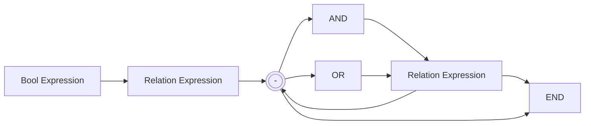
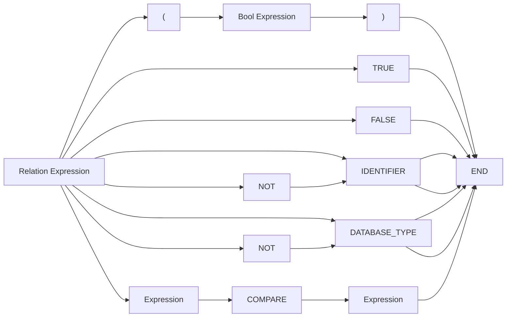
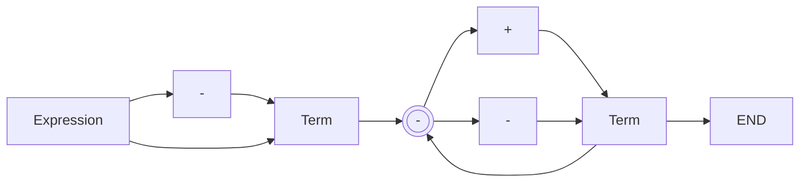
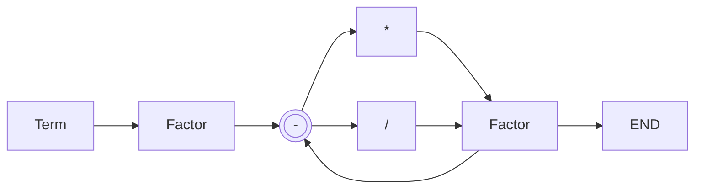
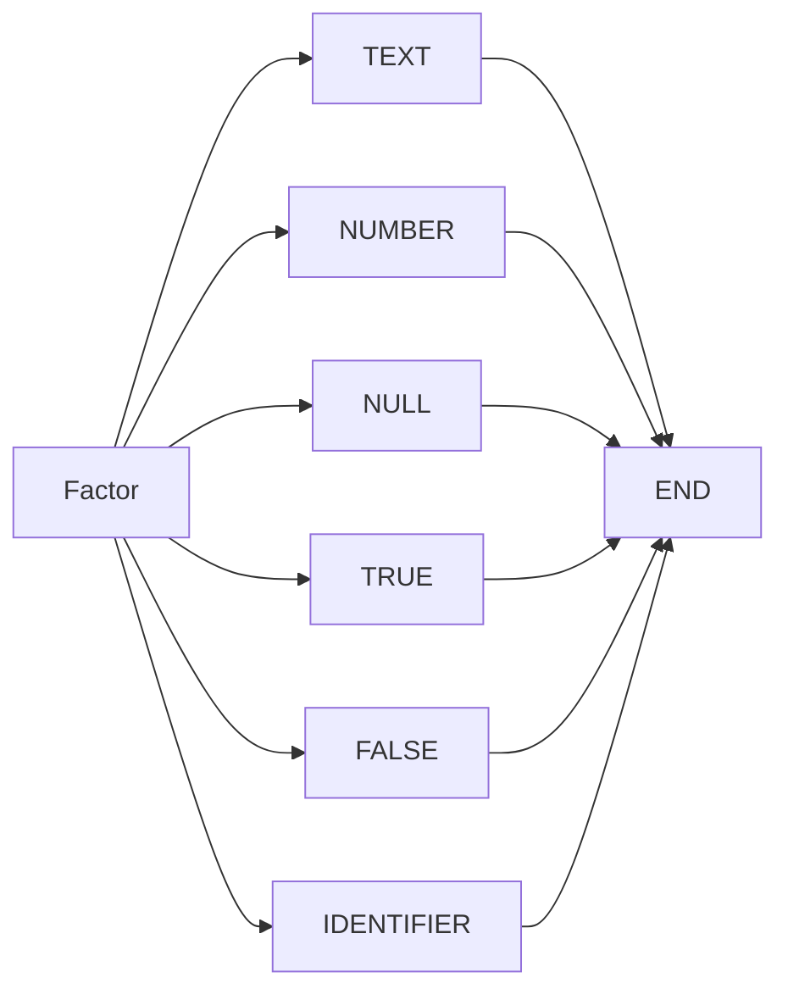

# Sql Template Condition

This is used to process if different preprocessor blocks in the SQL template should be used or not.
Below is information about how this is done.

```sql
#if <condition>
  SELECT * FROM table1;
#elif <condition>
  SELECT * FROM table2;
#endif
```

## Tokens

The condition text is split into different types of tokens.

|Type|Information|
|---|---|
|`IDENTIFIER`|One of the values the format process uses. It must start with a `$` character. For example, `$age`, `$searchDate`.|
|`DATABASE_TYPE`|The name of a database type constant. For example `MYSQL`, `POSTGRESQL`.|
|`NUMBER`|A number literal value or a hexadecimal value. For example, `42`, `3.142`, `0xA3`.|
|`TEXT`|A text literal value. This can start with a single or double quotation mark. Some escape characters can be used to. For example, `'Peter O\'Tool`.|
|`MULTIPLE`|The multiple `*` character.|
|`DIVIDE`|The divide `/` character (forward slash).|
|`ADD`|The addition `+` character.|
|`SUBTRACT`|The subtraction `-` character.|
|`OPEN_BRACKET`|The open bracket `(` character.|
|`CLOSE_BRACKET`|The closed bracket `)` character.|
|`COMPARE_EQUAL`|The compare equal characters. Can be either `=`, `==` or `===`.|
|`COMPARE_NOT_EQUAL`|The compare not equal characters. Can be either `!=`, `!==` or `<>`.|
|`COMPARE_LESS`|The compare less than `<` character.|
|`COMPARE_GREATER`|The compare greater than `>` character.|
|`COMPARE_LESS_EQUAL`|The compare less than or equal to `<=` character.|
|`COMPARE_GREATER_EQUAL`|The compare greater than or equal to `>=` character.|
|`TRUE`|The true constant value `true`, `TRUE`.|
|`FALSE`|The false constant value `false`, `FALSE`.|
|`NULL`|The NULL constant value `null`, `NULL`.|
|`AND`|The **AND** condition `&&` or `AND`.|
|`OR`|The **OR** condition `\|\|` or `OR`.|

## Nodes

The tokens are placed in an order of nodes that make up the structure of the condition. Below is the format of the nodes.

`BOOL_EXPRESSION`



`RELATION_EXPRESSION`



`EXPRESSION`



`TERM`



`FACTOR`



